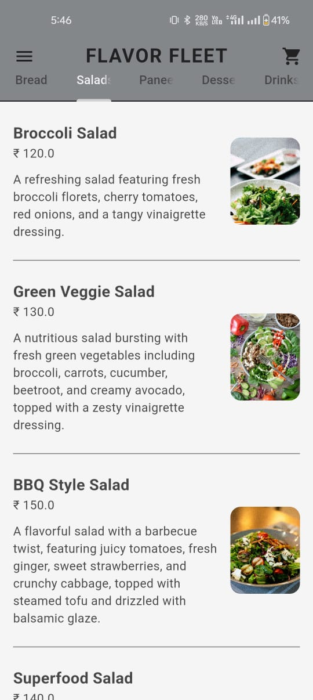
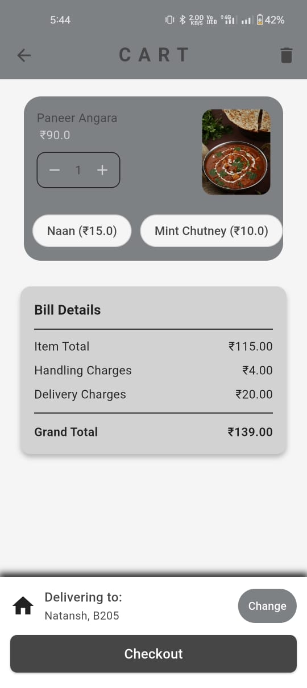
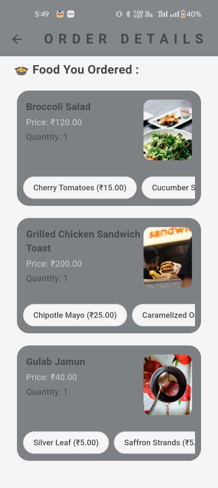

# FlavorFleet 🍽️  
*A cross-platform food ordering app for an e-commerce restaurant with powerful admin analytics.*

## 🚀 Overview

**FlavorFleet** is a complete end-to-end food ordering solution built using **Flutter** and **Supabase**. It enables users to browse restaurant items, customize orders, manage profiles and addresses, view order history, and easily reorder past favorites. Designed with both usability and scalability in mind, the app offers a seamless and intuitive experience for food lovers.

In parallel, an **Admin Dashboard** has been developed to enable the restaurant team to view insightful analytics about customer orders and behavior on a **daily, weekly, and monthly** basis.

---

## 📲 Features (User App)

- 🔐 **Authentication** with Supabase (Signup/Login)
- 🏠 **Address Management** — Add, edit, and delete delivery addresses
- 👤 **Profile Management** — Update name, email, and user preferences
- 🍔 **Order Food** — Browse menu, add items with optional addons
- ♻️ **Reorder Past Items** — Reorder quickly from previous purchases
- 🛠️ **Add-ons Customization** — Customize food with addons (sauces, extras, etc.)
- 📜 **Order History** — View and repeat previous orders
- 🎨 **Custom UI/UX** — Fully designed frontend with clean and modern interface
- 📱 **Cross-Platform** — Works on both Android & iOS

---

## 🛠️ Admin Dashboard

- 📊 **Analytics for Orders and Users**
  - Daily, Weekly, and Monthly breakdown
- 🧠 **Data Visualization** — User-friendly dashboard to monitor performance
- 🔗 **Hosted Separately** — Available via a dedicated GitHub repository

---

## 🧰 Tech Stack

| Layer        | Technology        |
|--------------|-------------------|
| Frontend     | Flutter            |
| Backend/Auth | Supabase (PostgreSQL + Auth) |
| State Mgmt   | Provider (Flutter) |
| Hosting      | Supabase |
| Design       | Custom-built Flutter UI |

---

## 🧱 Database Design

- Fully **normalized schema** for scalability and future-proofing
- Tables for:
  - Users
  - Orders
  - Order_Items
  - Food_Items
  - Addons
  - Addresses
  - Analytics logs

Designed to ensure minimal redundancy and optimal query performance.

---

## 🚧 Future Enhancements

- 🔔 **Push Notifications** for Order Status  
- 🧾 **In-app Payment Integration** (Razorpay / Stripe)  
- 🌐 **Multi-language Support**  
- 📍 **Map Integration** for Delivery Tracking  

---

## 🔗 Related Repositories

- [FlavorFleet Admin Panel](https://github.com/Natansh05/flavorfleet-admin)

---

## 🧑‍💻 Author

**Natansh Shah**  
📧 Email: [natansh.shah05@gmail.com]  
🔗 GitHub: [github.com/Natansh05](https://github.com/Natansh05)

---

## 📸 Screenshots

  
  
  

